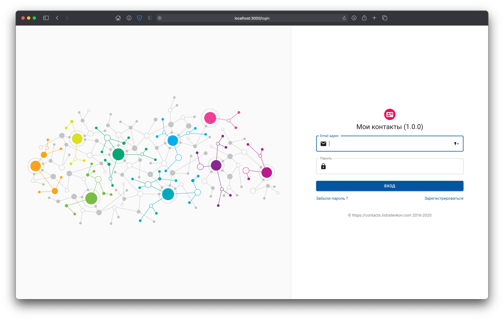
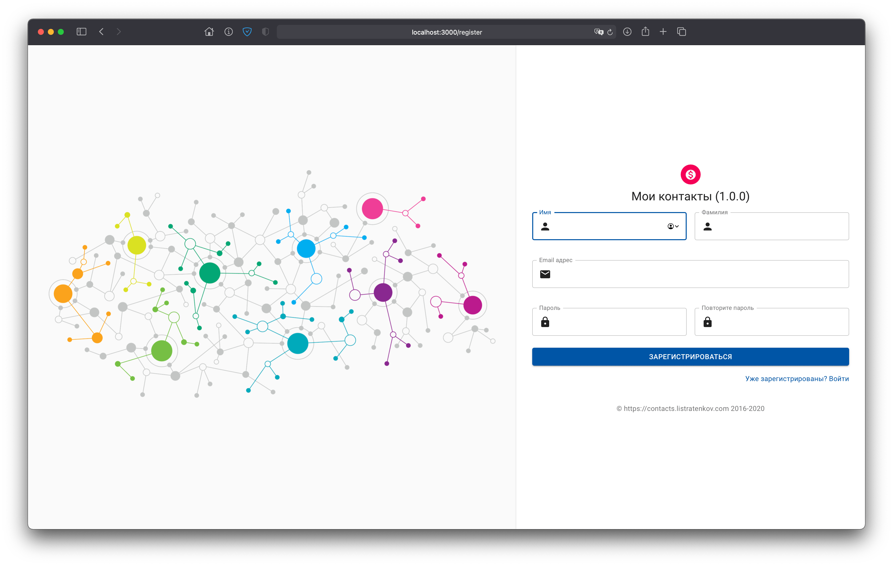
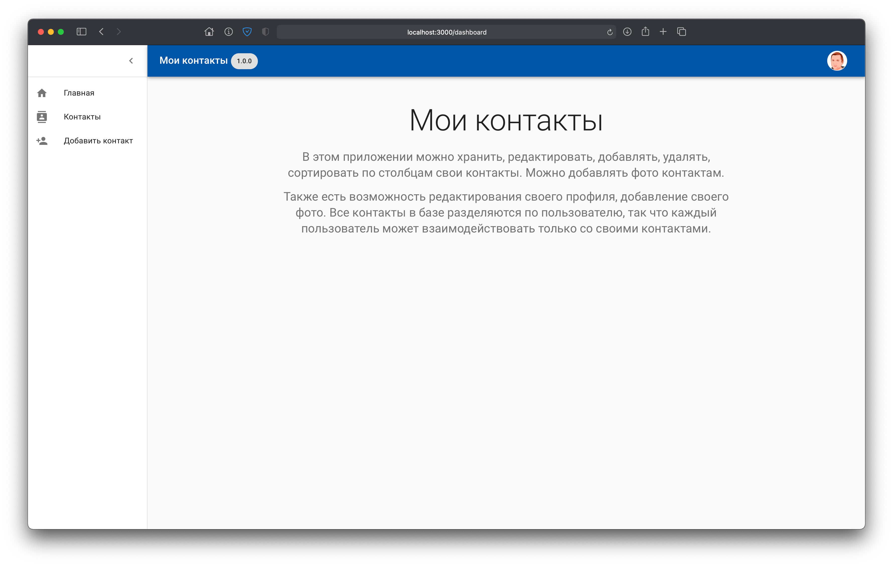
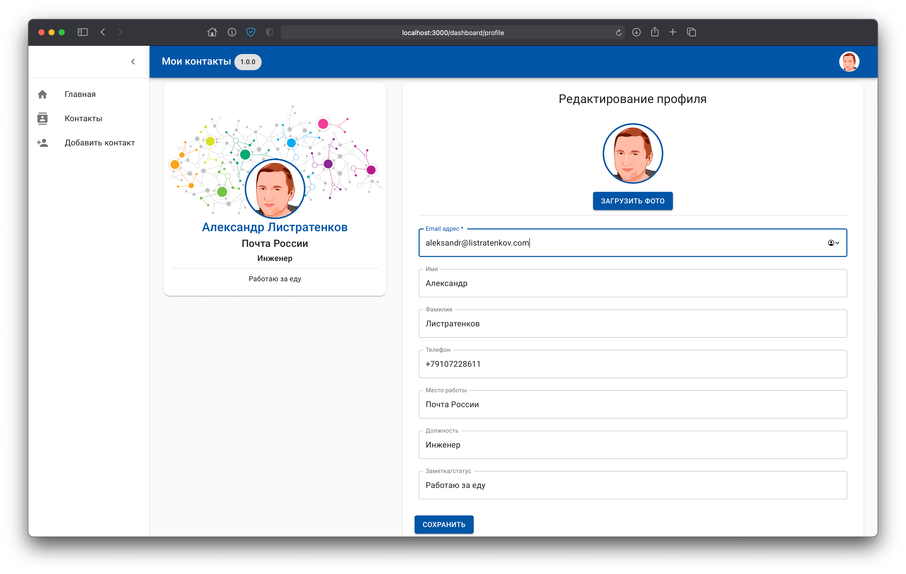
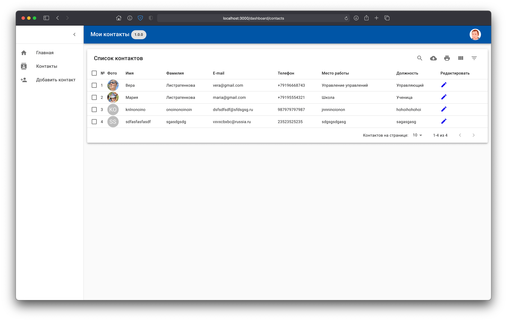
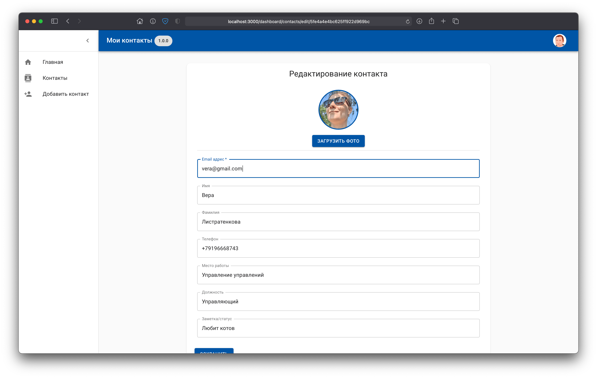
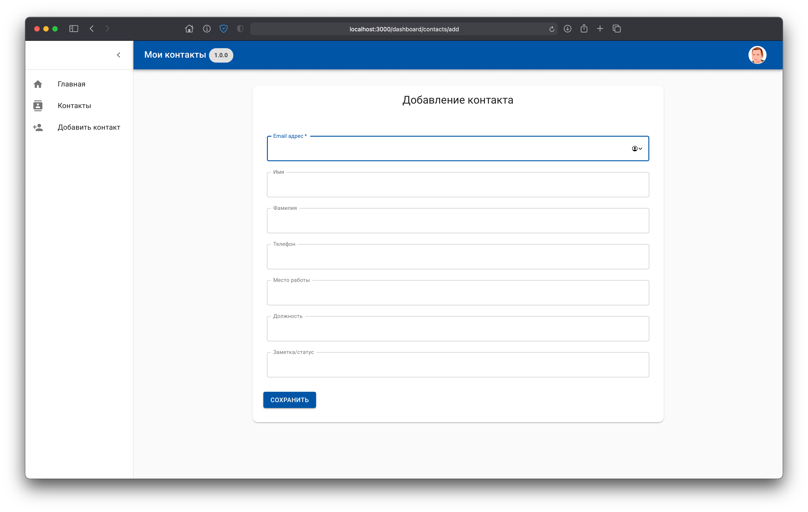

# Getting Started

[](https://www.codacy.com/gh/flags8192/my-contacts/dashboard?utm_source=github.com&amp;utm_medium=referral&amp;utm_content=flags8192/my-contacts&amp;utm_campaign=Badge_Grade)

Hello, My Friends
Thank you for having interest in this repository!

## Available Scripts

To use this application,\
first create rsa keys (private.key, public.key) and copy them to `src/backend/keys`

```bash
openssl genrsa -out private.key -aes256 4096
openssl rsa -pubout -in private.key -out public.key
```

Then fill in the file `src/backend/.env` with the required information

```bash
# Example
key_pass_phrase = "ICAKBgQCFPCqJYj20UY4BGfdss44rsw"
issuer = "Alexander Listratenkov"
subject = "mail@listratenkov.com"
audience = "https://listratenkov.com"

MONGODB_URI = "mongodb://server.flags8192.local/my-contacts"
```

Type `npm install` inside the root directory ( Download Front-end Dependencies )\
Type `npm install` inside `src\backend` server directory ( Download Server Dependencies )

####To runs the app in the development mode, in the project directory, you can run:

### `npm run dev`

Open [http://localhost:3000](http://localhost:3000) to view it in the browser.

The page will reload if you make edits.\
You will also see any lint errors in the console.

## Screenshots







